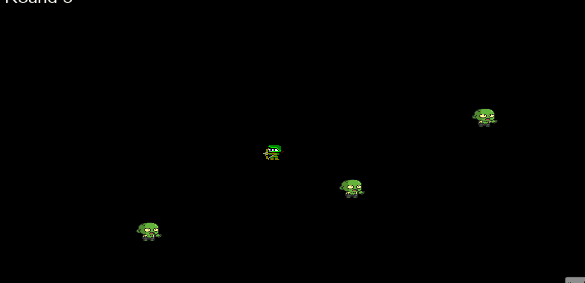

# 2D Simulation & Game Engine (C++ / SFML)

A real-time 2D simulation built in C++ using SFML.  
This project models enemy AI behavior, projectile motion, and collision detection using an object-oriented architecture and a structured game loop.

#Gameplay Demo

## Technical Highlights
- Designed object-oriented architecture (Game, Player, Enemy, Projectile classes)
- Implemented real-time simulation loop and state management system
- Developed enemy wave progression logic with increasing difficulty
- Built collision detection and projectile physics system
- Implemented sprite-sheet animation handling
- Debugged runtime and logic errors through iterative testing

## Technologies
- C++
- SFML
- Object-Oriented Programming
- Real-Time Systems Design

## Project Structure
- `main.cpp` – Program entry point
- `Game.*` – Core simulation and update loop
- `Player.*` – Player logic and input handling
- `Enemy.*` – AI movement and wave spawning
- `Assets/` – Textures and sprites
